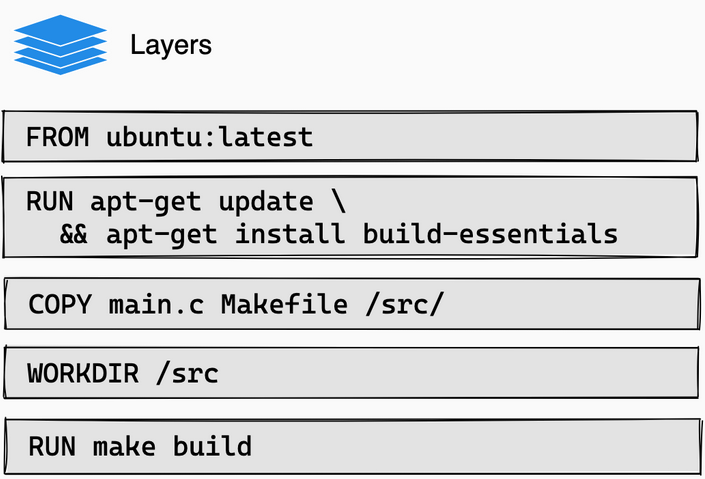

Docker for SW Development
=========================

.. post:: 01, February 2025
   :tags: development, infrastructure, tools, lunch-n-learn
   :category: Projects
   :author: len0rd

This is from a lunch-n-learn I hosted which aimed to showcase the features and advantages of using
docker during the development process. It includes with a few tutorials on how to use it.

Example code is hosted on my personal git server:  https://git.lenord.me/len0rd/docker_demo

What is Docker
--------------

- Framework for defining and running low overhead sand-boxed environments called 'containers' on your host

- Its more than a "cheap VM"

.. image:: https://iot.samteck.net/wp-content/uploads/2018/10/vm-vs-docker.jpg

https://medium.com/@saschagrunert/demystifying-containers-part-i-kernel-space-2c53d6979504

.. image:: https://cdn-images-1.medium.com/max/1600/1*bIQOZL_pZujjrfaaYlQ_gQ.png
    :class: dark-light

Why docker?
-----------

- version-controlled binary dependency management

- documented and repeatable dependency installation in a living (version-controlled) file

- "containerize once and run everywhere"

  - No more "it works on my machine"

- Industry-standard tool for CI/CD

Why docker for development?
^^^^^^^^^^^^^^^^^^^^^^^^^^^

- consistent environment between developers and CI servers

- Project environment isolation - useful when working multiple projects

- Easy to experiment with and revert dependency changes - agile dependency management

Docker and Linux
-----------------

- Docker is built atop core features of the Linux kernel (Namespaces) that are not available in Windows without WSL

- Docker desktop requires a license for commercial use. Docker server/CLI does not

docker image
------------

- Docker image is a snapshot of a linux rootfs

- Images can be built manually or downloaded from a registry

Command: ``docker image [--help]``

docker registry
---------------

- Pre-built images published online you can download

- Anyone can host a registry. Largest: https://hub.docker.com/search?q=

Command: ``docker pull <image_name>``

.. admonition:: Example

    Take a look at `example 1 <https://git.lenord.me/len0rd/docker_demo/src/branch/develop/01_registry_pull>`_

docker container
----------------

- Container is a spawned docker image

- Container *images* become *containers* at runtime

- You can spawn many containers from a single image

- Containers can run one or many processes, can provide user shells

Managing existing containers: ``docker container [--help]``

dockerfiles
-----------

- How you define custom images

- Good documentation: https://docs.docker.com/engine/reference/builder/

- Dockerfiles build off images. Each step in a dockerfile is a snapshot of changes to a linux rootfs

Command: ``docker build --help``

.. admonition:: Example

    Take a look at `example 2 <https://git.lenord.me/len0rd/docker_demo/src/branch/develop/02_simple_dockerfile>`_

Running Containers
------------------

- when a container is run you are in full control of what parts have access to the outside world

  - ports forwarded from container to host

  - network configuration in general

  - mounting files/folders from the host within the container

Running: ``docker run --help``

docker cache
------------

- Every step in a dockerfile is cached. if a step in the middle of the file changes, the image is rebuilt from that point onward

- https://docs.docker.com/build/cache/

cache minimization
^^^^^^^^^^^^^^^^^^

- docker caches can take up a lot of space

- Best practice is to combine logically linked commands into single steps to reduce the amount of cache a dockerfile build produces

- clearing out old cache: ``docker builder prune``

multi-stage builds
------------------

- newish (in the last couple years) feature, now standard is docker's BuildKit backend

- allows definition of distinct stages in the dockerfile to allow parallel build and reduce unnecessary dependencies

- https://docs.docker.com/build/buildkit/

.. admonition:: Example

    Take a look at `example 4 <https://git.lenord.me/len0rd/docker_demo/src/branch/develop/04_multistage_docker_file>`_

.. image:: https://git.lenord.me/len0rd/docker_demo/raw/branch/develop/04_multistage_docker_file/stage_graph.png
    :class: dark-light

DevContainers: an additional layer on top of docker
---------------------------------------------------

- Feature first added by VSCode, eventually published as an open standard by Microsoft:

  - https://containers.dev/

- Now multiple IDEs (IntelliJ, Visual Studio, NeoVim) have support for the standard

.. image:: https://code.visualstudio.com/assets/docs/devcontainers/containers/architecture-containers.png
    :class: dark-light

docker-compose: container orchestration
---------------------------------------

- ``docker run`` and ``docker build`` commands can get long and tedious for more complex containers

- ``docker compose`` solves this. Sits on top of docker and supports building/running multiple containers via yaml

.. admonition:: Example

    Take a look at `example 5 <https://git.lenord.me/len0rd/docker_demo/src/branch/develop/05_complex_run_with_compose>`_
