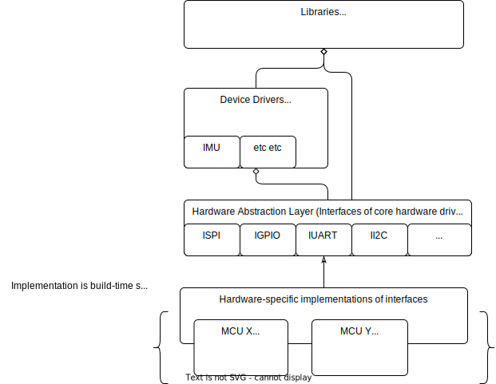
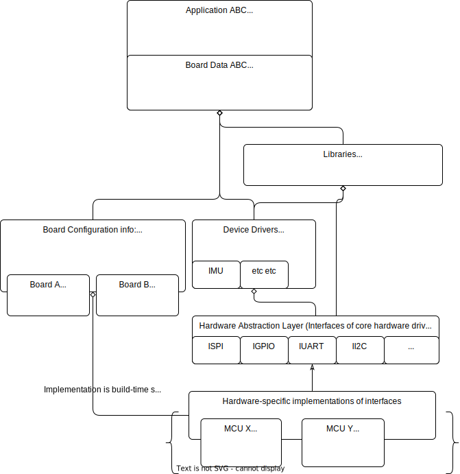

.. embedded_dev_primer:

Embedded Development Primer
===========================

.. post:: 05, January 2023
    :tags: diy, docker, embedded, development, toolchain, advice
    :category: Projects
    :author: len0rd

This post is meant to be an overview of some principles and practices I have found helpful for professional baremetal embedded development. This is meant for people who want to have total control over their embedded development environment and codebase.

Tools like `platformio <https://platformio.org/>`_ are excellent and can help us get projects off the ground but are perhaps a little opaque when it comes to toolchain and dependency management. In a professional setting, I often find I need total control over toolchains and dependencies down to the lowest-level. Learning how to intelligently manage these tools in a modern way has been a major effort in my career so far. This post will serve as a collection of my thoughts and lessons-learned from building multiple embedded projects from the ground up.

Lesson 1: Docker for toolchain management
-----------------------------------------

Step in my shoes for a minute: You start a new job. As usual your first task is setting up a development machine for the project. How do you setup the machine? Ah of course, the project has a 10,000 word README with detailed instructions of how to set everything up. It requires you use a very specific linux distro/kernel, install packages in the 'correct' order, and adhere to a specific directory structure. You follow the steps. The project fails to build. You now spend a week combing through the README, comparing your machine to other developers, maybe even reinstalling and starting from scratch.

Does this scenario sound familiar? Its something I have encountered multiple times in my career. Obviously there are a lot of issues with the "installation README" approach. I've also worked projects where a monolithic bash script handles dependency setup. While slightly better, this often encounters the same problems as a README. The root of the issue is that existing developers do not have to consistently use the installation README/script. Therefore these helper utilities are not maintained and eventually fall out of date. They are only touched when a new developer is required to struggle through them. They also become a nightmare when larger upgrades (like a distro bump) become necessary.

These dependency-management issues extend far beyond just setting up a new environment. They also contribute to the core "it works on my machine" problems we so often encounter. In embedded development such problems are amplified since our dependencies (toolchains, debug packages) seemingly cant be neatly container-ized like other languages (python).  `Docker <https://docs.docker.com/>`_ is the solution to all of these problems.

What does docker provide?

- **A documented, repeatable dependency installation method**

- **Dependency management that can be version-controlled with the project.** Your dockerfile and the dependencies it captures evolve with the project!

- **A consistent environment between developers and CI servers.** Greatly reducing the "it works on my machine" problem

- **Development environment freedom.** Developers can run any parent distro or IDE they want as long as they can use docker

- **Easy to experiment with and revert dependency changes.** This is huge when looking at bumping toolchains

- **Project environment isolation.** One project doesn't mess things up for another project

Truly I can not sing enough praises to how docker has streamlined embedded development in my career. Today, many IDEs support developing from within a docker container. For instance VSCodes `devcontainer extension <https://code.visualstudio.com/docs/devcontainers/create-dev-container>`_. But since docker is an independent tool, your free to use it with any ide/text-editor you want.

Some common questions:

What about debugging?
^^^^^^^^^^^^^^^^^^^^^

If my toolchain (gcc, gdb) is all within a docker container, how do I flash or debug my target hardware? Easy, just mount your devices into the container. When you run a container in privileged mode (``--privileged``) you can bind mount pretty much anything. So I will bind-mount ``/dev`` which means all USB devices attached to my host are also accessible within the container:

.. code-block:: bash

    docker run --mount source=/dev,target=/dev,type=bind --privileged --mount<BIND MOUNT PROJECT DIR> <IMAGE_NAME>

As you would expect, your container will also need udev rules installed if you want to access devices as a non-root user. This configuration step can be easily captured in your dockerfile!

Sharing a development dockerfile with a CI server?
^^^^^^^^^^^^^^^^^^^^^^^^^^^^^^^^^^^^^^^^^^^^^^^^^^

Dependencies/requirements for development are not the same as CI/CD requirements. Typically development requirements are a super-set of CI/CD requirements. ie: developers need additional debug/helper tools in addition to the core toolchain dependencies. This is where `multi-stage docker builds <https://docs.docker.com/build/building/multi-stage/>`_ come in. They allow you to define separate stages in a dockerfile. Thus allowing you to avoid unnecessary installations on CI. For example:

.. code-block:: dockerfile

    FROM ubuntu:latest AS project_builder_base

    RUN apt update \
        && apt install <toolchain>
        && ...

    FROM project_builder_base AS project_development

    RUN apt update \
        && apt install openocd <debugTool2> ...

Then in CI you only build the ``project_builder_base`` stage with:

.. code-block:: bash

    docker build --target project_builder_base -t projectTag:latest

Multi-stage builds like this require using dockers new build backend `"buildkit" <https://docs.docker.com/build/buildkit/>`_

Lesson 2: Abstract ASAP
-----------------------

Making unit-testable code in embedded development can be challenging. There is a good chunk of code that can only be run on your target and would be complex to either mock out or build an automated test-rig for. I'm talking about the low-level drivers that interact directly with a MCU's hardware peripherals. For this reason, I think its critical to create a decoupling abstraction layer as-soon-as-possible in modern embedded development.

What does that look like? Something like this:

Notice all SOC/MCU-specific code is encapsulated down in a single library which we abstract out with an interface layer immediately.

Benefits:

- **Easy to build a project for multiple targets** This benefit is huge. Imagine being able to build the same application for both linux (to unit test/simulate) and for your embedded target. You will catch bugs sooner and easier

- **All layers above the Hardware Abstraction Layer can be unit tested.** This includes device drivers (ie: sensor or actuator drivers) which in old-style development are often coupled to a specific MCU peripheral.

- **Component modularity.** At a system level, it is now very simple to move drivers and libraries from one MCU to another. As long as you have a Hardware Abstraction Layer (HAL) implementation for the new MCU you can mix and match things around. This can be critical in the prototyping stage of product development

I plan to dive into these concepts further in a future post.

Lesson 3: Separate the concepts of MCU and board
------------------------------------------------

This concept is going to add yet-another piece to the Hardware Abstraction Layer puzzle. Separating your HAL implementation from board-specifics is an important step to having a fully modular embedded development project.

What are "board-specifics"? This is the term I use to describe the configuration information of a MCU that is specific to a real piece of hardware. For instance: MCU's will have a set of GPIOs. These GPIOs can be used as basic GPIOs or they can be mapped to SPI clocks, UART data lines, etc etc. The functional mapping of these pins is a detail that is specific to the overall hardware (aka 'board') you run your application on. It makes sense that information like this that is specific to a PCB board layout of a particular MCU should be encapsulated in its own 'library'. This library is separate from your HAL implementation

Here's an extension of the earlier diagram with these concepts added:

Benefits:

- **Easy to track hardware revisions.** Structuring your project this way allows you to simultaneously support multiple revisions of a single board, which can be valuable if hardware availability is limited

- **Hardware Abstraction Layer doesnt change over board revisions.** With MCU peripheral drivers decoupled from board hardware - they dont need to change with each board change

- **Applications only instantiate drivers/resources they need.** Having a abstracted board data at the application-level allows you to only instantiate the drivers/peripherals that are required by the application. This will save memory and compute.

Conclusion
----------

This was a very brief overview of some of my most valuable baremetal development lessons-learned. Following these lessons allows truly agile hardware and software development in the embedded space, which I dont think was possible with older development paradigms. I plan to expand on each of these topics in future posts.
