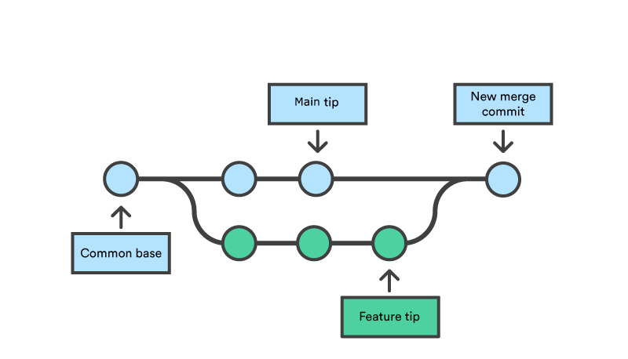

.. include this for helpful ascii symbols like degrees. See https://www.faschingbauer.me/about/site/recipes/isonum.html
.. include:: <isonum.txt>

Git basics
==========

.. post:: 16, December 2024
   :tags: embedded, development, infrastructure, tools, lunch-n-learn 
   :category: Projects
   :author: len0rd

This is from a lunch-n-learn I hosted. Yet another intro to git is not necessary on the internet, but I wanted to store
mine someplace easily accessible for when I need it again. This introduction is geared towards
Software Engineers and touches on some of the inner workings/concepts git employs.

Intro
-----

- *Distributed* Version Control System (VCS)

- The dominant source code management tool

- Git != Github

  - Git is open source

  - Github is an implementation of a git server. It hosts git repositories and a bunch of extra features on top

- git has a higher learning curve (than other VCS'), but in exchange gives you a lot more control

- There are many gui applications for git, but its valuable to understand what these apps are doing (Command Line Interface)

Distributed?
------------

Centralized (ie: Subversion/SVN) vs distributed (Git)

.. image:: https://k21academy.com/wp-content/uploads/2020/07/dvcs.png
    :class: dark-light

History
-------

- Originally written by Linus Torvalds, creator of linux. Starting in 2005

- built to address the problems with Version Control Systems that affected linux development the most

  - fast merging

  - strong safeguards against corruption

  - distributed workflow

- Git describes itself as "the stupid content tracker"

Getting started
---------------

- Create a new repo 

.. code-block:: bash

    git init

- Download an existing repo for the first time:

.. code-block:: bash

    git clone

The 3 States of a file
----------------------

.. image:: https://jwiegley.github.io/git-from-the-bottom-up/images/lifecycle.png
    :class: dark-light

**Viewing what stage things are in:**

.. code-block:: bash

    git status

.. note::

    ``git status`` is one of gits most useful commands! It provides a lot of information on the current state of your repository

Working tree / working directory
^^^^^^^^^^^^^^^^^^^^^^^^^^^^^^^^

Where all changes live at first. The directory you see on your machine.
2 types of files in the working directory:

- **Tracked files**: files git knows about. These are files that were in a prior commit
- **Untracked files**: any files in the working directory that have never been committed and are not staged

Staging area
^^^^^^^^^^^^

- Also called the index
- a spot to register changes from the working directory in preparation for a commit. a middle ground thats unique to git
- The version of a file in the staging area is separate from the same file in your working directory

Taking a file from Working Dir |rarr| staging: ``git add <file>``

Easiest to do in a visual editor when the your making a more complex index/commit (Example: VsCode)

Commits in the repository
^^^^^^^^^^^^^^^^^^^^^^^^^

- Commits are snapshots of the entire repository

- changes in the staging area turn into a commit with ``git commit``

  - shortcut: ``git commit -m "commit message..."`` if you dont need a full editor for the commit message

- commits build off one another to create the repository's "history"

- Helpful way to view history: ``git log``

  - Commits as a visual graph:  ``git log --oneline --graph``

How commits work
----------------

- Under the hood git has 3 fundamental objects:

  - **blob**: "Binary Large Object". Just the contents of a file

  - **tree**: a directory listing may contain blobs or more trees (imagine ``ls`` as an object)

  - **commit**: snapshot of the working directory

  - (There are also *tag* and *packfile* objects, but not important for this discussion)

.. image:: https://www.freecodecamp.org/news/content/images/2020/12/image-37.png
    :class: dark-light

As a directory:

.. code-block::

    DOCS/
        PIC.PNG
        1.TXT
    TEST.JS

Adding another commit
^^^^^^^^^^^^^^^^^^^^^

.. image:: https://www.freecodecamp.org/news/content/images/2020/12/image-41.png
    :class: dark-light

- Each commit is a full-snapshot of the repository, not just a diff. Changed BLOBS are added to the commit, Unchanged blobs/trees reference prior commits

.. admonition:: Aside (not important for typical git usage)

    You can prove the above model to yourself by using ``git cat-file`` within a repo

    - Start with ``git cat-file -p <COMMIT_SHA>``

      - commits point to a ``tree: <SHA>``

    - ``git cat-file -p <TREE_SHA>`` can display what a tree object looks like

      - from there you can get more tree or blob SHAs

      - ``cat-file -p <BLOB_SHA>`` just prints out the file itself

SHAs
^^^^

- SHA = Secure Hashing Algorithm

- 40-character hexadecimal SHA256 is used to to identify every object in a git repository quickly

  - these are the little tags of random numbers/letters in the above images (ie: ``62E7A``)

  - (in the images they are abbreviated from 40 characters for simplicity)

- Concept of hashing algorithms:

  - for any amount of input data, generate a unique fixed-length *hash* (code of 40 characters used by git)

  - repeatable. when fed the same data, you get the same hash

  - unique: 2 different inputs should not generate the same hash

    - if your input data changes by only 1 bit, the resulting hash will be different

  - See https://en.wikipedia.org/wiki/Cryptographic_hash_function

Remotes
-------

- Remotes are gits way of pointing to non-local repository locations (like bitbucket or github for instance)
- When your local changes are to be on the git server use `git push`
- When you want to get everyone's latest changes from the server: `git pull`
	- this `fetch` es changes from the remote repository and merges them into your local copy
	- you can get remote changes without merging them into your local copy with `git fetch`

Managing remotes
^^^^^^^^^^^^^^^^

In your local copy of a repository, you have control over what remotes your code is sent to/retrieved from

- The default remote is ``origin``

  - When first setting up a repository with ``git clone`` ,  ``origin`` will be set to the URL you're cloning from 

- list configured remotes ``git remote -v``

- Add a new remote: ``git remote add <name> <git_url>``

- Update the URL of a remote: ``git remote set-url <name> <new_git_url>``

- All push/pull commands can be directed at specific remotes

  - ex: ``git push origin``: push my local code on my current branch to ``origin``

- Another common remote name: ``upstream``

  - Used when 'forking' another repository on github

    - ex: https://github.com/len0rd/pyftdi

Branching
---------

- fundamental to collaborative work in a repository

- Branches are just nice pointers to commit SHAs

  - Under the hood: branches live in ``.git/refs/``. They're just files with a the commit SHA they currently point to

.. image:: https://www.freecodecamp.org/news/content/images/2020/12/image-42.png
    :class: dark-light

Branch Commands
^^^^^^^^^^^^^^^

- Create new branch ``git branch``

- select branch for working directory: ``git checkout``

  - shortcut: ``git checkout -b <new_branch_name>``

- what branch am i on? ``git status``

- ``HEAD``: special git pointer that points to the branch currently checked out in your local copy

.. image:: https://www.freecodecamp.org/news/content/images/2020/12/image-43.png
    :class: dark-light

Adding a commit to a branch. Branches automatically update to the latest commit applied to them

Merging
-------

Most common merge method: 3-way merge
^^^^^^^^^^^^^^^^^^^^^^^^^^^^^^^^^^^^^

- pictured above

- The three commits used in this merge:

  - Head of destination

  - Head of branch to be merged

  - the common ancestor (allows git to know the exact diffs its combining)

- The merge operation itself is usually facilitated by an online tool, but you have to address merge conflicts manually

- Start a merge: ``git merge <SOURCE_BRANCH>``

- Note! All merge commands merge into the branch you are currently on

.. code-block:: bash

    git checkout develop
    # this will merge feature/a into develop
    git merge feature/a

- There are many other merge types/strategies that will be discussed later

Dealing with conflicts
^^^^^^^^^^^^^^^^^^^^^^

- Conflicts can occur for a few reasons (when merging A and B):

  - file was deleted on A but edited on B

  - same portion of a file was edited on A and B

- when there's a conflict, git will halt the merge, mark the conflicts, and tell you to resolve them

- Conflict resolution too hard? you can always back out: ``git merge --abort``

- What a conflict looks like

.. code-block::

    hello
    <<<<<<< HEAD
    there! i want to add stuff here
    =======
    there.
    another
    line!
    >>>>>>> feature/tmiller/more_stuff

- To resolve you need to decide if you want the current branches version ``HEAD`` / "ours", the branch being merged version (``<BRANCH_NAME>`` / "theirs") or some combination of both.

- Regardless, you should always remove the marker lines (``<<<<<``, ``>>>>``,  etc) before finishing the merge

  - GUIs/Editors can be helpful here (VSCode)

- To finish the merge:

  - add conflicted (but now resolved) files with ``git add``

  - commit with ``git commit`` (git will autofill the message)

Stashing
--------

- Temporarily save working-tree changes so you can come back to them later

- Useful when you need to switch branches but your current work isnt ready to commit yet

  - (Mercurial has a plugin called ``shelve`` that works in a similar way)

- Stashes are stored in a stack-like structure

  - stack-like because it works like a stack by default, but you can operate on things in the middle of the stack without issue

Working with stashes
^^^^^^^^^^^^^^^^^^^^

`Git stash options <https://wac-cdn.atlassian.com/dam/jcr:d6fec41a-dc66-4af6-8b0f-c23d271eaf8e/01.svg?cdnVersion=1352>`_

- Current stashes: ``git stash list``

- See what's in a stash: ``git stash show [-p] [STASH_NAME]``

- Apply a stash: ``git stash apply [STASH_NAME]``

- Drop a stash from the stack: ``git stash drop [STASH_NAME]``

- Apply the latest stash and drop from the stack: ``git stash pop``

How stashes work
^^^^^^^^^^^^^^^^

Internally each stash is just a set of commit objects stored in the ``.git/`` folder

Aliases - make git more convenient
----------------------------------

I use bash aliases to make using git from a terminal faster/easier. These can be added to your ``~/.bashrc`` for more convenient git usage. Here are some that you may find useful. 

.. code-block:: bash

    alias gs='git status'
    alias ga='git add'
    alias gc='git commit'
    alias gpush='git push'
    alias gpull='git pull'
    # update git submodules to the correct commit
    alias gsub='git submodule update --init --recursive'
    # prune away local copies of branches that have been merged on remote
    alias gprune='git fetch -p && git branch --merged | grep -i -v -E "master|develop|main|dev|development" | xargs git branch -d'
    alias gdiff='git diff'
    # git log with one line per commit and a nice graph
    alias glog="git log --oneline --decorate --graph --branches --remotes --tags"

Git's also has an `alias system <https://git-scm.com/book/en/v2/Git-Basics-Git-Aliases>`_. Aliases are stored in Git's config file (``~/.gitconfig``). You can use these to perform more complex git commands. All aliases here will start with ``git``. Example:

.. code-block:: bash

    [alias]
        # list most recently visited branches see http://ses4j.github.io/2020/04/01/git-alias-recent-branches/
        recent = !git reflog show --pretty=format:'%gs ~ %gd' --date=relative | grep 'checkout:' | grep -oE '[^ ]+ ~ .*' | awk -F~ '!seen[$1]++' | head -n 10 | awk -F' ~ HEAD@{' '{printf(\"  \\033[33m%s: \\033[37m %s\\033[0m\\n\", substr($2, 1, length($2)-1), $1)}'

Usage: ``git recent``

At the end of the day, most of the git commands you use are just aliases around a set of more fundamental commands

Git Flow
--------

- "git flow" is the term used to describe accepted best practices for git usage on collaborative projects.

- Everyone using git typically follows some or all of git flow

- The highlights:

  - Primary work branch, typically ``develop``, where all new features get merged

  - committing directly to the ``develop`` branch is not allowed

  - Add features or fix bugs in separate feature / bugfix branches. Then merge them into ``develop``

  - For releases, you should branch off ``develop`` and tag the commit used for a specific release

  - Release branches should only receive bugfixes, if anything

  - ``release`` branch is merged back into ``develop``

    - Reality: sometimes a release will have hacky/temporary fixes to get a product out the door. So the merge back into ``develop`` will contain a portion of the ``release/`` branch changes, not all

.. image:: https://wac-cdn.atlassian.com/dam/jcr:cc0b526e-adb7-4d45-874e-9bcea9898b4a/04%20Hotfix%20branches.svg?cdnVersion=2536
    :class: dark-light

Other recommendations
---------------------

#. Avoid copy-pasting third-party code into a project

   - Its a pain to track and update code copied in. it adds a bunch of unnecessary stuff to your history and can be difficult to update
 
   - Alternatives:
 
     - use a package manager built for the source code language
 
     - Fork + Submodule strategy (discussed later)
 
       - guarantees the code is always internally accessible
 
       - easy to track internal changes to the code
 
       - easy to pull in upstream fixes/updates
     
       - easy to push any approved internal changes upstream

#. Delete branches once they are merged

   - Unless there's a strong reason not to (like if its a ``release/`` branch) 

#. Most git hosts (github, bitbucket) allow you to setup rules to enforce git-flow. Use them.

   - restrict commits on ``develop`` / ``release/`` branches to merge commits only

   - Require approval to merge

   - Require build/tests to pass to merge

Terminology Reference
---------------------

When searching online, its helpful to use the proper terms to describe your problem

+-------------------+---------------------------------------------------------------------------------------+
| term              | explanation                                                                           |
+===================+=======================================================================================+
| Repository / repo | a project tracked by git. a folder that contains a ``.git/`` folder                   |
+-------------------+---------------------------------------------------------------------------------------+
| Index             | aka "Staging". Area for files/diffs before they are committed                         |
+-------------------+---------------------------------------------------------------------------------------+
| Working directory | Your local copy of the repository where you make changes                              |
+-------------------+---------------------------------------------------------------------------------------+
| Commits           | Snapshot of repository state                                                          |
+-------------------+---------------------------------------------------------------------------------------+
| History           | The commits, branches, merges etc in a repository make that repos history             |
+-------------------+---------------------------------------------------------------------------------------+
| SHA               | Secure Hashing Algorithm. A unique 40 character code used to identify all git objects |
+-------------------+---------------------------------------------------------------------------------------+

Other Useful Commands
---------------------

+---------------------------------------------------------------------+---------------------------------------------------------------------+
| Description                                                         | Command(s)                                                          |
+=====================================================================+=====================================================================+
| **List commits between refs**                                       | ``git log <since>...<until>``                                       |
+---------------------------------------------------------------------+---------------------------------------------------------------------+
| **Stash a specific file**                                           | ``git stash push -m <stashname> <file>``                            |
+---------------------------------------------------------------------+---------------------------------------------------------------------+
| **Create a patch**                                                  |                                                                     |
+---------------------------------------------------------------------+---------------------------------------------------------------------+
| of current diff                                                     | ``git diff > <patch_file_name>``                                    |
+---------------------------------------------------------------------+---------------------------------------------------------------------+
| of commits (range)                                                  | ``git format-patch <since_commit>`` ex:                             |
|                                                                     | ``HEAD~2`` = last 2 commits                                         |
+---------------------------------------------------------------------+---------------------------------------------------------------------+
| **Apply patches**                                                   | ``git apply <patch_file>`` *Can be glob*                            |
+---------------------------------------------------------------------+---------------------------------------------------------------------+
| **Pull rebased branch from remote** (also reset an amended commit)  | ``git reset --hard origin/<branch/name>``                           |
| Will DELETE local working tree changes!                             |                                                                     |
+---------------------------------------------------------------------+---------------------------------------------------------------------+
| **Put last commit back into staging**                               | ``git reset --soft HEAD^``                                          |
+---------------------------------------------------------------------+---------------------------------------------------------------------+
| **Update Remote URL**                                               | ``get remote set-url <REMOTE> <NEW_URL>``                           |
+---------------------------------------------------------------------+---------------------------------------------------------------------+
| **Delete a local branch**                                           | ``git branch -D <BRANCH_NAME>``                                     |
+---------------------------------------------------------------------+---------------------------------------------------------------------+
| **Graph of latest commits**                                         | ``git log --oneline --decorate --graph --branches --remotes --tags``|
+---------------------------------------------------------------------+---------------------------------------------------------------------+

References
----------

- https://en.wikipedia.org/wiki/Git
- https://git-scm.com/docs
- https://www.freecodecamp.org/news/git-internals-objects-branches-create-repo/
- https://jwiegley.github.io/git-from-the-bottom-up/
- https://www.atlassian.com/git/tutorials/saving-changes/git-stash
- https://www.atlassian.com/git/tutorials/using-branches/git-merge
- https://docs.github.com/en/pull-requests/collaborating-with-pull-requests/addressing-merge-conflicts/resolving-a-merge-conflict-using-the-command-line
- https://www.atlassian.com/git/tutorials/comparing-workflows/gitflow-workflow
