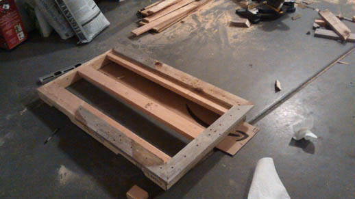
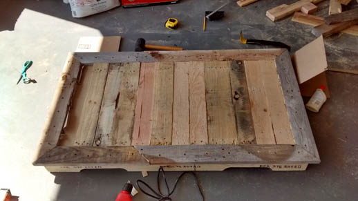

.. palletDesk:

Pallet Desk
===========

.. post:: 02, September 2018
    :tags: furniture, diy, amateur, pallets
    :category: Projects
    :author: len0rd

As I finished up my sophomore year at university, I realized that I needed my own desk. At that point I had lived in three different apartments. All 3 of them had desks provided, and all of those desks were mediocre at best, downright broken at worst. What's worse is at the time I worked from home, which meant I *needed* a reliable desk. With the summer about to hit, and plans to work full-time from home, I knew I needed something fast. Here's the end result:

Before we get into this build, I will note that I'm writing this guide > 2 years later. This means I have forgotten some details of the build process, but have also have the gift of hindsight thanks to this desk being my main piece of furniture for the last 2.5 years. Like seriously, I eat, study and work at this thing everyday.

Plans
-----

Requirements
^^^^^^^^^^^^

Before I started building I had to think through what I wanted. I came up with some basic ideas:

- I didn't need storage. Drawers would be difficult and expensive to integrate, and I don't think they look that good anyways.

- It needed to be cheap. I had a job as a software engineer at the time, but it did not pay much at all. The desk couldn't eat too much of my budget.

- Durability. I wanted a desk that could last me a long time. Like 5+ years. I'm unsure if I'll actually use it for that long, but I'm confident it could last.

- Portability. During the planning stages I had already moved twice and was about to move a third time. I needed a desk that wouldn't be a hassle to move. I designed the desk so that it could be easily torn down by one person, and fit inside my Toyota Camry. Ironically, I haven't moved since I finished building the desk, but I have still had occasion to tear it down and move it, which is surprisingly convenient.

- Sitting/Standing. I'm a decently tall person. Measuring in at around ~6'5" (2m), I'm not a huge fan of short things. I like sitting in high chairs where my legs can dangle. I wanted something similar in a desk that would allow me to stand or sit depending on what I was feeling.

Design
^^^^^^

With the requirements thought out, I started planning how I was going to build everything. Between planning/designing I probably spent a month or two just *thinking* about how I would build the desk. I spent a lot of time online looking at what other people have done. Seeing other peoples designs is the one reason I currently have a Pinterest account.

There were some really cool designs online, but I needed something simple. This was my first woodworking project, and I knew I *would* (hehe) be making a lot of mistakes. All of these thoughts culminated into a single whiteboard sketch:

Yep. That's it. It was all a lot clearer in my head. Essentially the red 'rectangles' are 2x4 cross beams that would support the desktop and create a structure to build onto. The measurements were mainly based on what would fit in my Camry. Note: this only fits in the car when I put the back seats down so the desk can go through the trunk and into the back of the car. pics further down. I also measured a few desks nearby to see what an appropriate depth for a monitor + keyboard would be.

Build
-----

Pallet Acquisition
^^^^^^^^^^^^^^^^^^

There are a lot of guides on how to get pallets online. If you're in the US, check the free section of Craigslist or your local classifieds. You can also just walk into local places and ask if they have any pallets that you can use. Alternatively, just drive behind businesses and see if they have pallets stacked near the dumpster.

If you have a smaller car, be prepared to potentially tear down the pallet on site. Pallets were a bit larger than I expected and some of them would not fit in my car! Because of this, I had to pass up on some of the nicer pallets out there. In all, I think this project took 2-3 pallets. It could be done with less, but my teardown methods were less than ideal.

The problem with pallet wood is that it's a bit of a mixed bag. Sometimes you get a really new pallet that is made out of decent wood, sometimes you get a pallet that's a few years old and on the verge of falling apart. Sourcing newer pallets should be your priority. I didn't bother doing so and paid the price through many stages of the build.

Pallet Teardown
^^^^^^^^^^^^^^^

The best way to get usable wood from a pallet is to use a jig saw. Period. If you don't have one, buy one online or borrow a friends. It's worth it especially if you want to do a lot of projects like this. With a jig saw, it's very easy to align the blade between the pallet planks and cut through the nails holding them in place. If you have room to spare, you could also use a table saw and just cut off the pallet planks before they're nailed into the base.

If you're a poor college student as I was, the other option is a crowbar, hammer and *a lot* of patience. With this method you need to jimmy the crow bar in between the pallet plank and base and slowely wedge out the nails holding the plank in place. Making sure you dont strain one end of the plank too much and crack it. This is a delicate process that takes a long time and often ends in breaking the pallet planks much to the despair of the builder.

Because of this expense of learning, Perhaps only 50% of the 3 pallets I had turned out usable. Unfortunately I don't have any images of this stage of the process likely due to the rage-inducing nature of it all. I worked on this portion of the project at night after getting home from school across a couple of days.

Desktop
^^^^^^^

Finally, with all the pallets torn down, I had wood I could start working with. I started out by building the basic frame of the desktop, cutting pallet base 2x4's to size and joining them at 45deg on the corners. This was stupid. Getting perfect 45deg angles to come together and hold well is not easy, especially if you don't know what you're doing. It looks okay in the end product, but if I were todo it again, I would have done simpler, more reliable corners.

As I was starting, a friendly neighbor came over to see what I was working on and lent me these corner clamps. Regardless of the join you're doing, I think these could be pretty helpful

Fortunately, the crappy corners are mitigated by the cross beams that run the width of the desktop. For these I decided to go with new 2x4's. I realize this is against the spirit of the whole project, but at this point I was *not* about to teardown another pallet for 2x4s. Additionally, the rest of the entire desktop would be secured into these, so they needed to be non-horrible.

Basically every piece of this project is secured by a combination of wood glue and screws.

Also, for this entire project, wood was cut to size using my friends chop saw. Not sure what I would've done without it. (I mean everything *could* be done with a hand saw... but).

With the basic frame in place, it was time to start building the visible part of the desktop. I started by bordering the exterior with pallet plants to make something like a picture frame for the middle. The chop saw came in handy, helping make angles that match.

From this angle it looks like the border is slightly, missaligned, but I dont ever notice this and it seems to be fine. Notice that there is a ~1" lip off the edge of the frame. The main reason for this was to keep some of the frame exposed so the middle of the destop could be secured to it. But also because it looks cool.

With the border completed, I could move on to filling in the middle of the desktop. Before doing this, glued and stapled down some crate paper, in the hopes that it would help retain any epoxy that slipped through once it was time for that.

Once the crate paper was secured I started cutting and fitting pallet planks. I would cut one at a time to test the fit and make sure it was tight. Then I would line the edges and bottom with glue, push it into its general location and use a mallet to nudge it as far to the right as possible. Below is the partially completed top (note the exposed crate paper on the left side):

Once a single board was pushed to the far right side, It would be secured on the 3 2x4 frame pieces with screws and glue. Once all the pieces were secured I went back and started sanding. The desktop was made from a combination of three different pallets, so the wood was vastly different in quality and thickness.

My **biggest** regret in this project was not spending enough time sanding the top. Especially the middle of the desk, I should've spend multiple hours sanding it, with multiple passes at different levels of courseness to make sure it was smooth and flat. A planar and/or a really good electric sander should be a must for this portion of the project. A single board in the middle of my destop is slightly thicker than the others, which means my keyboard can not lie flat without wobbling.

If you plan on covering the top in epoxy as I did, this is also a good time to make *sure* any and all holes are filled with wood filler (I made wood filler by mixing wood glue with some sawdust). You dont want anywhere for the epoxy to escape so make sure all the old nail holes on the pallet boards are properly filled.

Legs
^^^^

With the desktop done it was time to move on to the legs. There are lots of different options on what to do here. I decided to go with some basic 4x4's. I measured a few bar counters/stools to decide what would be a good height for the legs. I finally decided on ~4ft. This allows the collapsed legs to fit within the desktops footprint for easy portability.

As always transport with the Camry was enjoyable:

Nothing magic here, just measure and cut. There are definitely better ways to secure the cross beams to the legs, but the best I came up with was using metal plates. The long cross bar is removable, meaning the legs can be broken down into 3 pieces: the left 2 legs, the right 2 legs, and the long cross bar.

Securing the leg assembly to the desktop is done with bolts. Two massive bolts per leg are inserted in perpendicular directions through the desktop and leg. The 3/8" bolts are then secured with washer, split-locking washer and nut.

Once again, my impatience got the better of me, and I failed to sand the legs as much as I should have. Don't skimp on sanding!

Stain and Epoxy
^^^^^^^^^^^^^^^

With the desk fully constructed, it was time to add the finishing touches to make it a usable piece of furniture. First up was staining. I went with a homemade solution for the stain. I let a gallon of vinegar, steel wool and hydrogen peroxide... ferment(?)... soak for a week. There are a lot of videos online about this type of homemade stain. The desired outcome of this stain is a rustic/aged look. The hydrogen peroxide helps add a red tint to the stain.

The results for me were a bit mixed. Some board took the stain beautifully; producing a slightly dark stain with a perfect hint of red. Others ate it right up and produced an incredibly dark wood with 0 red. Especially the legs, which the stain essentially just made dark brown. In hindsight, I should have tested the stain more on some scrap wood before applying it.

That 5 gallon bucket next to the desk? That's the stain... I may have made a little too much.

With everything stained I was ready to finish up by applying epoxy to the desktop. The idea here is that epoxy is fairly self-leveling, which will help reduce any error in my build. With using old beatup pallet wood, I also thought it best to use epoxy to avoid any latent splinters. The epoxy provides a smooth glass-like surface which has looked great since it was applied.

I got a gallon kit of the stuff off Amazon. It came with instructions, and I made sure to watch *many* youtube videos about epoxy application before attempting. As previously stated, I wish I had spent more time sanding the top, and making sure all the holes many, many nail holes were filled in better. Despite these errors, the epoxy took fairly well. I started with a thin coat to try and help 'seal' the top. This likely helped with some of the smaller holes, but there was nothing to be done for the larger ones. After that, I applied the whole thing. Pouring right in the middle and letting it spread itself out. The end result is a nice glossy surface that really brings out the subtle stain in some of the boards.

And, in case you doubted, here's the desk broken down and in the trunk of my Camry:

tl;dr
-----

The desk works great, and overall the design is very forgiving to rookie mistakes. Make sure you have the proper tools (Jigsaw) for pallet disassembly. Dont skimp on sanding the desktop, and if you're going to use epoxy, make *absolutely* sure that you have adequately filled in all the nail holes in the pallet wood before application.

