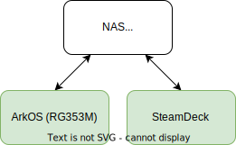

.. syncthing_ark_os

.. for symbols like left/right arrow
.. include:: <isonum.txt>

Setup Syncthing on arkos
========================

.. post:: 09, July 2023
   :tags: emulation, infrastructure, guide
   :category: Hobbies
   :author: len0rd

`Syncthing <https://syncthing.net/>`_ is a handy tool for syncronizing files between multiple machines. I currently use 2 devices for playing retro games: a Steam Deck and a `Anbernic RG353m <https://anbernic.com/products/rg353m>`_ running `arkos <https://github.com/christianhaitian/arkos>`_ My goal here is to syncronize save states and games between the devices. Here's my goal for a final setup:

For now, this writeup only covers RetroArch savestate syncing. There are also plenty of guides and advice online for setting up syncthing on the Steam Deck or a NAS, so the focus here will be ArkOS.

In general, I've found the best way to setup this kind of sync system is to configure the sync folder on ArkOS, then on a NAS and finally on the Steam Deck

Installing Syncthing on ArkOS
-----------------------------

#. Configure Retroarch save location

   - By default (at least on my ArkOS version), retroarch will place saves/savestate files in the roms folder of the system they belong to. This can work, but I prefer having all these files in a single location. Using single folders simplifies the syncthing configuration a little, and makes sense for how I store ROMs vs saves on my NAS. To adjust these settings, head to: Retroarch |rarr| Settings |rarr| Saving |rarr| Disable any "Sort save..." options

#. Identify retroarch savestate location. For my install they were here

   - ``/home/ark/.config/retroarch/saves/``

   - ``/home/ark/.config/retroarch/states/``

#. Install Syncthing
   
   - "Enable Remote Services" in ArkOS by navigating to: Options |rarr| "Enable Remote Services". The window that appears during this will briefly show your local ip address if you dont already know it

   - ssh into ark os

     i. ``ssh ark@<local_ip_addr>``

     ii. Password (default): ``ark``

   - Install Syncthing

     a. Since ArkOS is ubuntu based, you can follow `Syncthings guide <https://apt.syncthing.net/>`_

     b. Here's what I did

        .. code-block:: bash

          sudo curl -o /usr/share/keyrings/syncthing-archive-keyring.gpg https://syncthing.net/release-key.gpg
          echo "deb [signed-by=/usr/share/keyrings/syncthing-archive-keyring.gpg] https://apt.syncthing.net/ syncthing stable" | sudo tee /etc/apt/sources.list.d/syncthing.list
          sudo apt update
          sudo apt install syncthing

Syncthing configuration
-----------------------

#. Make syncthing gui accessible

   - To make configuration easy, I suggest making the Syncthing GUI accessible from a local machine other than the 353M. To do this edit syncthings config while ssh'ed into arkos

   - Open ``~/.config/syncthing/config.xml``

   - Update gui/address. ``<address>127.0.0.1:8384</address>`` -> ``<address>LOCAL_IP_ADDRESS:8384</address>`` then save.

   - Now startup syncthing from your ssh session with ``$ syncthing``

   - On your host machine, you should now be able to access the syncthing web UI at ``<ARKOS_LOCAL_IP_ADDR>:8384``

#. From the syncthing gui

   - Remove the default folder sync and create a new one

     a. name: whatever you want

     b. folder path: ``/home/ark/.config/retroarch``

     c. In ``Ignore Patterns`` check the enable box

     d. everything else on default. Hit save 

     e. Now enter the Ignore Patterns

        .. code-block::

          // DO NOT IGNORE
          !/states
          !/saves
          // IGNORE (everything else)
          *

#. Now you can add a remote device. in this case i have a NAS that acts as the primary remote device. all other devices sync to it

.. note::

  As you share across devices make SURE you add the ignore pattern everywhere!

Syncthing auto start
--------------------

See `syncthings guide here <https://docs.syncthing.net/users/autostart.html?highlight=windows#using-systemd>`_

#. ``systemctl --user enable syncthing.service``

#. ``systemctl --user start syncthing.service``

Resource optimization
---------------------

Syncthing has `a nice page <https://docs.syncthing.net/users/tuning.html#tuning-for-low-resources>`_ detailing what configuration changes you can make to minimize resource utilization

#. These changes will be made in ``~/.config/syncthing/config.xml``

#. For example one thing you can do is disable the web gui with: ``<gui enabled="false" tls="false" debugging="false">``

