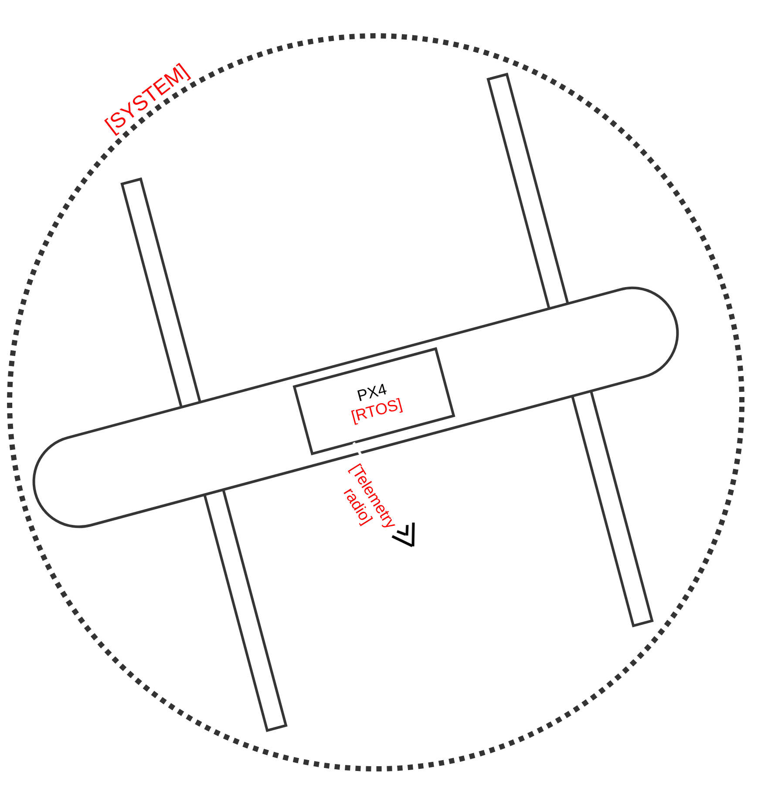
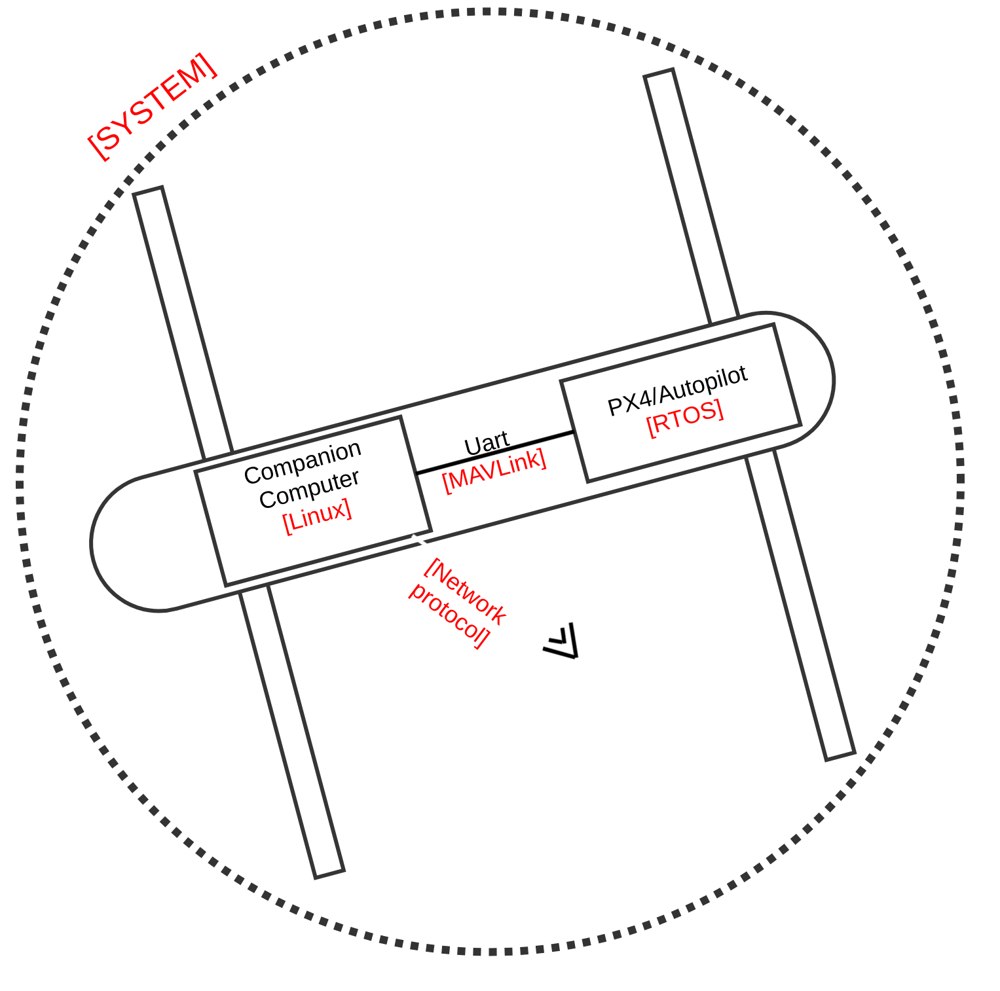
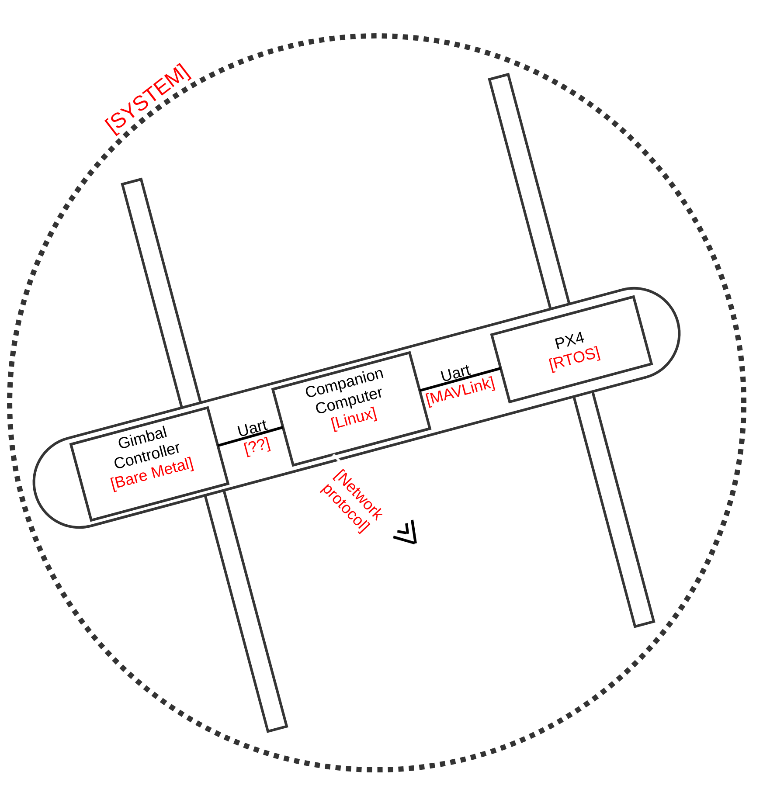
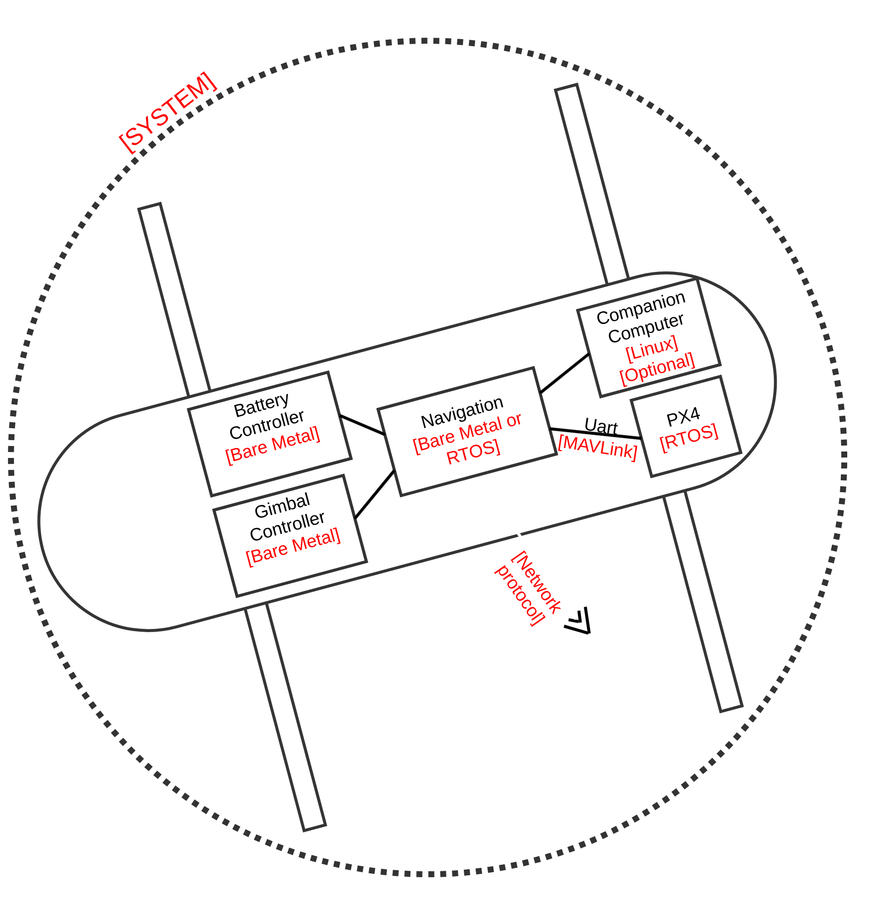

Unified Messaging Solution for Small UAS
========================================

.. post:: 16, September 2023
    :tags: embedded, development, sw-architecture
    :category: Projects
    :author: len0rd

A major challenge I've repeatedly encountered while working in embedded software is
communication protocols in a heterogeneous and evolving system. The main difficulty
lies in obtaining modern messaging system conveniences while supporting the lowest-common
denominator in your system (ie: a tiny Cortex-M0 running in the system).

To clarify:

- Heterogeneous = System made up of multiple MCUs/SOMs all with different levels of capability
- Evolving = System who's architecture (number of MCUs, their location), is actively being changed

This post is a high-level overview of a solution I previously developed to address some of these issues in a small Unmanned Aircraft System (UAS) project. It describes the motivation behind the solution, the solution itself, and its short-comings/lessons-learned.

Motivation
----------

Small UAS Comm Setups
^^^^^^^^^^^^^^^^^^^^^

Here's a typical UAS setup you may see in a hobby-ist scenario. Its using an open-source autopilot (PX4) and a telemetry radio to commincate with a ground station.

Here's another option that's a little more robust. It includes an open-source autopilot along with a "companion
computer", typically some kind of ARM SOM, for performing more CPU-intensive but less time-critical tasks.

In this scenario you'll often see a more embedded-friendly protocol used for communication between the autopilot
and companion computer. While a more robust and feature-rich network-stack-based protocol is used for communication with the companion computer and ground station (ROS, protobuf, proprietary)

Small UAS Problem Architectures
^^^^^^^^^^^^^^^^^^^^^^^^^^^^^^^

The above UAS architectures are common and well-supported in the open-source/hobbyist UAS community. However problems begin to arise with more complex requirements. Such as:

- UAS must support communication with a smart battery

- UAS must support optional communication with a hot-swapable gimbal

- UAS must support ground station communication with or without a companion computer

- UAS software should be robust to network topology evolution as the system design is refined.

Here's what a couple of these scenarios may look like:

System Challenges
^^^^^^^^^^^^^^^^^

- Heterogeneous system. Running anything from a baremetal Cortex-M0 to a Linux SOM. Vastly different capabilities

- Network topology is constantly evolving as the system is refined. Some chips/boards are consolidated, others are broken out, while others are changed to be optional modules in the final product

Software Challenges
^^^^^^^^^^^^^^^^^^^

- Maintainability of separate messaging frameworks
    - Maintaining even more than one messaging framework in a project quickly becomes tedious. From past experience I knew that this scenario can make projects difficult to understand and work in. Maintainable code should be the highest priority when architecting software solutions

- Efficiency of separate messaging frameworks
    - If each device uses a separate protocol to communicate with its neighbors, cycles will be lost translating messages from one protocol to the other. If any of these protocols have additional logic (routing, messaging state), it will multiply the software difficulty and overhead

- Convenient data sharing between modules
    - Software evolves over time. Information you thought was only needed by one library is later needed by another. A good messaging system facilitates convenient data sharing between modules by decoupling data producers from consumers

- Portability of modules
    - Again, system architecture and modules evolve over time. If you are using multiple messaging stacks, this evolution becomes more difficult.
    - ie: Library A was designed to use a messaging protocol with a network stack. What happens if later you now want to run Library A on a bare-metal component?
    - ie: Library A runs on the same processor as Library B so they share information via an internal method (direct call/api, IPC, etc), what happens if on the next system revision, library A now needs to run on a different processor than library B?

    .. image:: ../assets/img/writeup/unified_messaging_small_uas/module_portability_problem.png
        :class: dark-light

