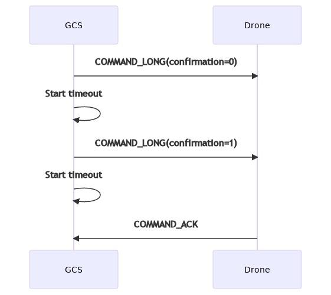
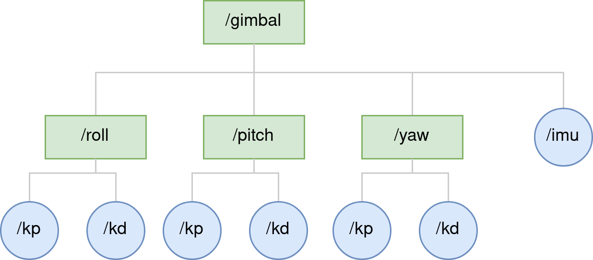
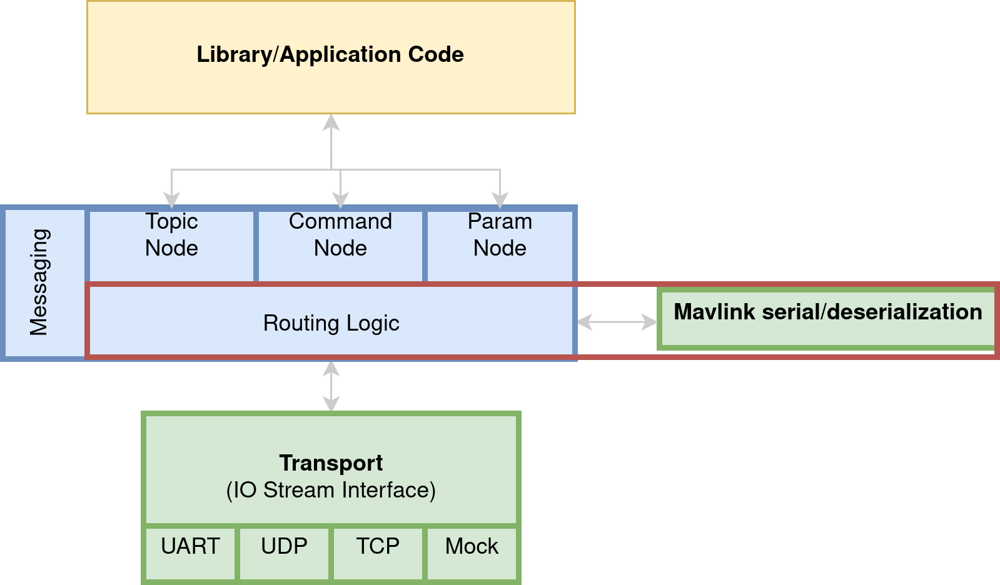
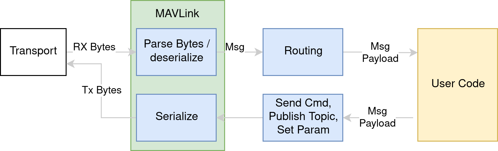
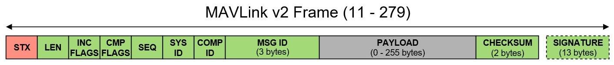
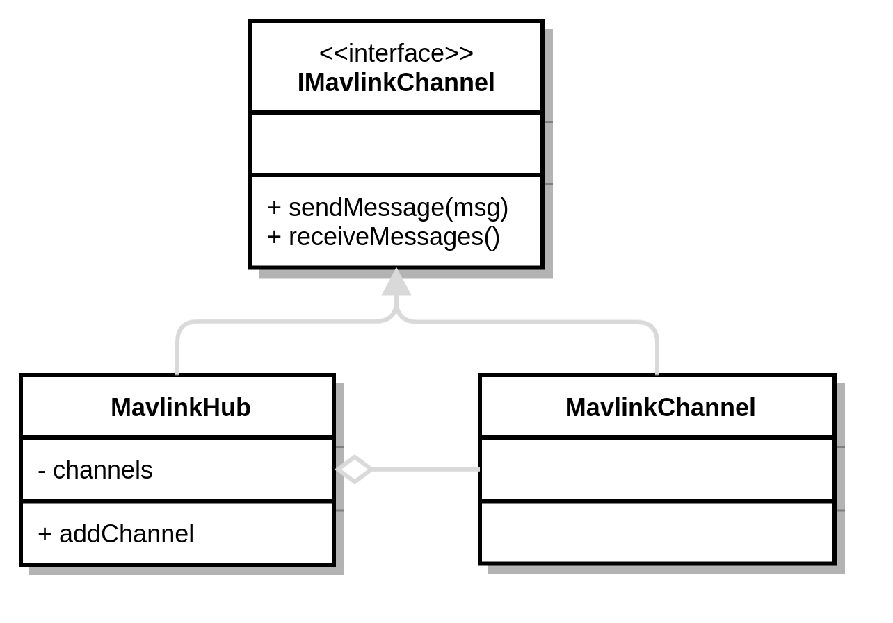
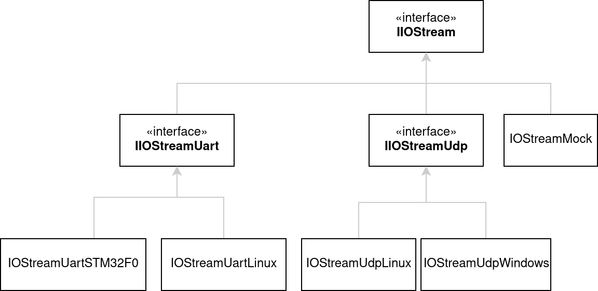

Unified Messaging Solution for Small UAS
========================================

.. post:: 16, September 2023
    :tags: embedded, development, sw-architecture
    :category: Projects
    :author: len0rd

A major challenge I've repeatedly encountered while working in embedded software is
communication protocols in a heterogeneous and evolving system. The main difficulty
lies in obtaining modern messaging system conveniences while supporting the lowest-common
denominator in your system (ie: a tiny Cortex-M0 running in the system).

To clarify:

- Heterogeneous = System made up of multiple MCUs/SOMs all with different levels of capability
- Evolving = System who's architecture (number of MCUs, their location), is actively being changed

This post is a high-level overview of a solution I previously developed to address some of these issues in a small Unmanned Aircraft System (UAS) project. It describes the motivation behind the solution, the solution itself, and its short-comings/lessons-learned.

Motivation
----------

Small UAS Comm Setups
^^^^^^^^^^^^^^^^^^^^^

Here's a typical UAS setup you may see in a hobby-ist scenario. Its using an open-source autopilot (PX4) and a telemetry radio to commincate with a ground station.

.. image:: ../assets/img/writeup/unified_messaging_small_uas/small_uas_setup_a.png
    :width: 400
    :class: dark-light

Here's another option that's a little more robust. It includes an open-source autopilot along with a "companion
computer", typically some kind of ARM SOM, for performing more CPU-intensive but less time-critical tasks.

In this scenario you'll often see a more embedded-friendly protocol used for communication between the autopilot
and companion computer. While a more robust and feature-rich network-stack-based protocol is used for communication with the companion computer and ground station (ROS, protobuf, proprietary)

.. image:: ../assets/img/writeup/unified_messaging_small_uas/small_uas_setup_b.png
    :width: 400
    :class: dark-light

Small UAS Problem Architectures
^^^^^^^^^^^^^^^^^^^^^^^^^^^^^^^

The above UAS architectures are common and well-supported in the open-source/hobbyist UAS community. However problems begin to arise with more complex requirements. Such as:

- UAS must support communication with a smart battery

- UAS must support optional communication with a hot-swapable gimbal

- UAS must support ground station communication with or without a companion computer

- UAS software should be robust to network topology evolution as the system design is refined.

Here's what a couple of these scenarios may look like:

.. image:: ../assets/img/writeup/unified_messaging_small_uas/small_uas_setup_c.png
    :width: 350
    :class: dark-light

.. image:: ../assets/img/writeup/unified_messaging_small_uas/small_uas_setup_d.png
    :width: 350
    :class: dark-light

System Challenges
^^^^^^^^^^^^^^^^^

- Heterogeneous system. Running anything from a baremetal Cortex-M0 to a Linux SOM. Vastly different capabilities

- Network topology is constantly evolving as the system is refined. Some chips/boards are consolidated, others are broken out, while others are changed to be optional modules in the final product

Software Challenges
^^^^^^^^^^^^^^^^^^^

Besides the expected system challenges, our team was also aware of a number of future software challenges that would arrive based on prior experience:

- Maintainability of separate messaging frameworks
    - Maintaining even more than one messaging framework in a project quickly becomes tedious. From past experience I knew that this scenario can make projects difficult to understand and work in. Maintainable code should be the highest priority when architecting software solutions

- Efficiency of separate messaging frameworks
    - If each device uses a separate protocol to communicate with its neighbors, cycles will be lost translating messages from one protocol to the other. If any of these protocols have additional logic (routing, messaging state), it will multiply the software difficulty and overhead

- Convenient data sharing between modules
    - Software evolves over time. Information you thought was only needed by one library is later needed by another. A good messaging system facilitates convenient data sharing between modules by decoupling data producers from consumers

- Portability of modules
    - Again, system architecture and modules evolve over time. If you are using multiple messaging stacks, this evolution becomes more difficult.
    - ie: Library A was designed to use a messaging protocol with a network stack. What happens if later you now want to run Library A on a bare-metal component?
    - ie: Library A runs on the same processor as Library B so they share information via an internal method (direct call/api, IPC, etc), what happens if on the next system revision, library A now needs to run on a different processor than library B?

    .. image:: ../assets/img/writeup/unified_messaging_small_uas/module_portability_problem.png
        :class: dark-light

Motivation
----------

With all these challenges in mind, it was decided that we would expand on an available open-source messaging system to address our needs.

Why make yet another messaging service?
^^^^^^^^^^^^^^^^^^^^^^^^^^^^^^^^^^^^^^^

There is no shortage of open-source messaging platforms/services/implementations available for use today. The decision to roll our own was not made in a vacuum and many of these libraries were experiemented with and compared to our requirements before we determined to build our own. A major piece of this was our requirement to have a single messaging service used across the entire UAS system:

- A single messaging system implementation reduces code complexity and maintenance cost

  - Lessons learned from previous projects: multiple systems can create a version management nightmare

- Single system increases module portability

- Bring the convenience of modern messaging frameworks down to the embedded space

    What about protobuf, flatbuf, ROS, etc?

- Most open-source messaging protocols are not bare-metal friendly and require a networking stack

- Protocols are typically not transport-agnostic: they make no attempt to decouple transport mechanism from the overall protocol

- Open-source protocols utilize C++ language concepts that are not bare-metal friendly (exceptions, large templates, STL containers, dynamic allocation)

- If the protocol can run without a network stack, it has a large object and/or runtime cost (memory, processor utilization)

(ROS2 does address many of these issues with micro-ROS)

After internal reviews, it was decided that we would build our messaging service on top of the open-source `MAVLink <https://mavlink.io/>`_ protocol. More on MAVLink, its pros/cons and why it was chosen later.

Solution Architecture
---------------------

From here I began designing the architecture of our UAS messaging service. The service borrows most of its ideas from existing messaging systems but with an emphasis on portability and embedded-friendly design. Here's the high-level architecture:

Lets break this down and talk about each component:

Object Request Broker Nodes (ORBs)
----------------------------------

Lets first look at the object request brokers. That's this top portion, the main API for all higher-level library/application code:

- ORB Nodes define the core protocols supported by the messaging library

- Each ORB Node provides a convenient interface for user code to accomplish common tasks

  - Topic Node: Your typical pub/sub data stream

  - Command Node: RPC with ACK

  - Param Node: Get/Set system parameters

ORB Nodes can be thought of as simplified `ROS protocols <http://wiki.ros.org/ROS/Technical%20Overview>`_. Or as amplified `MAVLink microservices <https://mavlink.io/en/services/>`_

ORB: Topic Node
^^^^^^^^^^^^^^^

Topic Node handles a number of common tasks:

- Allow anyone to subscribe to a datastream, informing subscribers via callback when a new message has arrived in that stream

  - Number of customization options: specify data rate, subscribe to multiple producers (ie: logging topic)

- Abstracts the source of the data. Same API is used to subscribe to a local and remote topic. Eases adapting the system to architecture challenges

.. admonition:: Challenge: Topic Multicasting

    The largest challenge I encountered when implementing the topic node was what I call "topic multicasting". That is, getting a topic routed to multiple subscribers in a network that has a 1+ star topology. ie:

    .. image:: ../assets/img/writeup/unified_messaging_small_uas/small_uas_setup_d.png
        :class: dark-light
        :width: 500

    In this sytem, if "Battery Controller" and "Companion Computer" want to subscribe to a topic produced by the "Gimbal Controller", that topic data needs to be routed through the "Navigation Controller". To keep routing and message traffic to a minimum, the "Navigation Controller" needs to keep track of the potentially multiple endpoints that topic data needs to go. This is the "multicasting" problem: having the gimbal controller send a single message that the navigation compter then seamlessly sends to only the interested parties.

    This routing/multicasting problem is all handled internally by the messaging system.

ORB: Command Node
^^^^^^^^^^^^^^^^^

The command node is meant to function as a Remote Procedure Call (RPC) service. A node on the network issues a command and that command is responded to with an acknowledgement.

MAVLink already has a `Command microservice <https://mavlink.io/en/services/command.html>`_ which implements a basic RPC. Unfortunately this service fell short for us since it only functions with 2 message types as commands. The meaning of the contents in these messages changes based on a command enum. There were a lot of features added on to MAVLink to support this design decision.

    MAVLinks Command microservice.

We wanted the ability for many message definitions to be treated as commands. This helps the code handling commands be self-documenting: you are no longer working with the abstract message fields that in the core MAVLink ``COMMAND`` message. It also helps reduce on-the-wire overhead since all commands dont have to use the same message.

Our command ORB implements a few key features:

- Automatic retry and timeout.

- Callback on acknowledgement received

- Handles local or remote command routing for maximum portability

.. admonition:: Challenge: Handle exactly once

    In a lot of cases, the command node's automatic retry feature is helpful. However sometimes there are critical commands that must be run exactly once. Automatic retries can cause trouble in this circumstance:

    .. figure:: ../assets/img/writeup/unified_messaging_small_uas/cmd_node_race_condition.png
        :class: dark-light

        Example of a feasible (but somewhat unlikely) scenario of a command ack race condition. A remote node finishes and sends an ACK for a command, but it is note received before the automatic-retry timeout occurs on the sender, causing the sender to emit the already-completed command again.

    - This problem was never solved in my first implementation of this architecture.

      - Remote ACK and Command retry logic race condition

        - Could be a problem for any state-based command.

        - Commands are required to be handled in a non-blocking way, so chances of this are low but still a risk

      - Solution ideas

        - Messaging command node should keep track of handled commands in an identifiable/reproducible way (CRC?)

        - Commands that want to be handled exactly once mark a flag in their message header so the remote command node is aware.

ORB Param Node
^^^^^^^^^^^^^^

Parameters operating conditions that you want saved on a per-unit basis in a non-volatile way.

For this node, I used `MsgPack <https://msgpack.org/>`_ as the underlying non-volatile storage method for keeping track of parameters. MsgPack is great since its essentially compact JSON. This means at the cost of some memory, parameters could be stored in NVM such that it was easy to add/remove parameters in future releases without requiring any complex NVM migration/versioning code.

The core concept of the parmeter node was to organize parameters into a tree structure. In C++ this would essentially translate into the very natural struct containing structs model.

    Example of a parameter node tree

With MsgPack, the Param node would store and reference parameters via a path-like string.

So to get or set the gimbals roll proportional gain, you would use the path ``/gimbal/roll/kp``. In C++ code the parameters would accessible like this:

.. code-block:: c++

    struct GimbalAxisGain {
        float kp;
        float kd;
    };

    struct GimbalParams {
        GimbalAxisGain roll;
        GimbalAxisGain pitch;
        GimbalAxisGain yaw;
        uint16_t imu;
    };

I was pleasantly surprised with how easily this node came together. No major challenges encountered. Its easy to work with both from a factory user, and a development maintenance standpoint.

Routing and MAVLink
-------------------

This messaging system utilizes the MAVLink protocol for its messaging de/serialization capabilities. While MAVLink advertises itself as a full messaging system, with a defined set of common messages, it also makes it easy to define and generate your own custom set of MAVLink messsages. This was our primary approach: Define a large set of appication-specific messages and use MAVLinks generated code to serial/deserialize them off the wire:

MAVLink: Message and Packets
^^^^^^^^^^^^^^^^^^^^^^^^^^^^

Here's MAVLinks packet definition:

You can see it has a relatively small header, followed by a message payload and finally a message checksum.
The header also includes the message id, payload length, and the address of the source/sender of the message.

XML is used to define what goes into a payload. For instance:

.. code-block:: XML

    <message id="80" name="COMMAND_CANCEL">
      <wip/>
      <!-- This message is work-in-progress and it can therefore change. It should NOT be used in stable production environments. -->
      <description>Cancel a long running command. The target system should respond with a COMMAND_ACK to the original command with result=MAV_RESULT_CANCELLED if the long running process was cancelled. If it has already completed, the cancel action can be ignored. The cancel action can be retried until some sort of acknowledgement to the original command has been received. The command microservice is documented at https://mavlink.io/en/services/command.html</description>
      <field type="uint8_t" name="target_system">System executing long running command. Should not be broadcast (0).</field>
      <field type="uint8_t" name="target_component">Component executing long running command.</field>
      <field type="uint16_t" name="command" enum="MAV_CMD">Command ID (of command to cancel).</field>
    </message>

A generator like `pymavlink <https://github.com/ArduPilot/pymavlink>`_ can then be used to generate code in multiple languages from this XML.

MAVLink Advantages
^^^^^^^^^^^^^^^^^^

- open-source protocol

- Community familiarity (easier support of 3rd-party hardware)

- Message generation into multiple languages

- Efficient serialization: 12 bytes of over-the-wire overhead per message

- Efficient library size and serialization compute overhead

- Already used as the offboard transport of our chosen autopilot (Pixhawk)

MAVLink Challenges
^^^^^^^^^^^^^^^^^^

- Message destination (routing info) is not part of packet header, but we need it to be in every message

- Simple message definitions: no nested structs or custom types beyond enums

- No built-in way to define message visibility (public API vs internal message)

- Open source generator is difficult to extend/customize

MAVLink Routing
^^^^^^^^^^^^^^^

Routing in MAVLink is conceptually very simple. Each message has a system and component ID. The System ID is a uint8 that addresses a full UAS system, while the component ID addresses a single mcu/component in a system. `MAVLinks site <https://mavlink.io/en/guide/routing.html>`_ explains in more detail. Here are the basic routing rules:

+-------------------+----------------------+------------------------------------------+
| ``target_system`` | ``target_component`` | description                              |
+===================+======================+==========================================+
| X ( >0)           | X ( >0)              | Targetting a single 'concrete' component |
+-------------------+----------------------+------------------------------------------+
| X                 | 0                    | System Broadcast                         |
+-------------------+----------------------+------------------------------------------+
| 0                 | X                    | Component broadcast                      |
+-------------------+----------------------+------------------------------------------+
| 0                 | 0                    | Broadcast                                |
+-------------------+----------------------+------------------------------------------+

Message Routing: Modularity
^^^^^^^^^^^^^^^^^^^^^^^^^^^

As menitoned early on, being flexible to system architecture/network topology changes is a core philosophy of this library. To that end, the message routing system was intentionally designed such that the network could be easily adjusted with little to no impact on application code.

Core definitions:

``MavlinkChannel`` Handles sending a receiving MAVLink messages over a single 'transport' ie: a single UART

``MavlinkHub`` Handles routing logic and moving messages around between multiple ``MavlinkChannel`` s.

As show in prior examples, we commonly employed a star or multi-star `network topology <https://en.wikipedia.org/wiki/Star_network>`_. Meaning, most network nodes would only need a single ``MavlinkChannel``, while only a couple nodes would need to be a ``MavlinkHub``. In C++, these components were designed to inherit from the same base class. This means to change a MCU from a single channel node to a hub node only required passing in a differently constructed reference on startup of the messaging system! The flexibility of this was very exciting for me.

To summarize:

- Hubs can be transparently inserted without awareness of higher-level modules

- Channel-to-Channel routing rules handled by a Hub

- Result: system network topology can be changed with little to no code changes

Transport interface
-------------------

Finally, lets end with an overview of the messaging systems transport interface:

.. image:: ../assets/img/writeup/unified_messaging_small_uas/high_level_arch_transport.png
    :class: dark-light

One of our key requirements was that the messaging library must be transport agnostic: it will work whether you're communicating via UDP or UART.

To that end, a simple interface was defined and then implemented for all our needed transports

Transport: advantages
^^^^^^^^^^^^^^^^^^^^^

- Messaging library only requires IIOStream references

- Messaging library protocols are transport agnostic

- porting to new transports/architectures is much easier

Transport: challenges
^^^^^^^^^^^^^^^^^^^^^

- User has to implement logic to create/remove transports during runtime (non-issue on bare-metal)
- abstraction can cause transport inefficiencies: Rely on lower driver to work that out (UDP/TCP packet size)
- Abstraction makes it difficult to introspect transport performance at messaging-level

Review
------

Thats a brief summary of the architecure I implemented for a UAS messaging system. Lets go into the good, bad and lessons I learned from this.

Advantages
^^^^^^^^^^

- The Object Request Brokers are easy-to-use interfaces for the most common user tasks

- ORBs allow our entire codebase can share the same implementation for common tasks

- Proper routing system on top of MAVLink increases transport efficiency

  - minimizes messages sent over channels to those requested (base MAVLink chooses to broadcast messages everywhere too often)

  - reduces messages moving over lossy radio link

- Ability to transparently make a component a "Hub" allows flexible network topology (minimal code impact)

Motivation/Requirement fullfillment
^^^^^^^^^^^^^^^^^^^^^^^^^^^^^^^^^^^

Did this implementation address all the requirements I discussed at the beginning?

- Maintainability of separate messaging frameworks
  - Single framework eases maintenance and versioning burden. Decreases complexity and developer onboarding time (don't need to learn nuances of 2 systems)

- Efficiency of separate messaging frameworks
  - Unified framework means no message translation boilerplate necessary

- Convenient data sharing between modules
  - Topic Object Request Broker makes it easy to decouple data producers from consumers

- Portability of modules
  - All modules in the project use a unified messaging framework that facilitates onboard and offboard comm. Modules have freedom to move to different portions of the network with minimal effort.

Unresolved challenges
^^^^^^^^^^^^^^^^^^^^^

Overall I was really happy with this overall architecture. However, by the time I left this company there were still a number of unresolved challenges with the architecture which I would have like to eventually address:

- On a network of multiple systems, how do vehicles de-conflict system-id assignment?

  - Internal arbitration protocol is needed

- Allowing for nuances in implementation across target architectures

  - Big issue: thread safety on OS targets which isn't a concern on bare metal

  - Need proper levels of abstraction, even within the library itself (OSAL)

  - Thread-safe wrappers of user-facing interfaces

- Traffic shaping

  - Some messages are more important than others

  - How to prioritize messages being emitted over a channel in a memory-efficient way?

- Running as an OS-service

  - Running messaging as a service that multiple distinct applications can interact with

  - Need proper levels of abstraction, even within the library itself (OSAL)

- Filling statically allocated containers

  - To be bare-metal friendly, I built this library to be 100% statically allocated. The drawback is of course the possibility of one or more of its many static containers becoming full, inhibiting or breaking additional functionality.

  - I developed a number of introspection tools to help us know when this happens

  - Still inconvenient, can always use more tooling and introspection into complex and critical libraries
